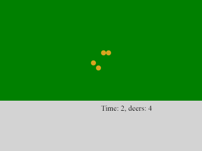

# Математическая модель Лотки-Вольтерры («хищник-жертва»)

1. Устанавливаем node.js
// Прописываем в терминале код редактора следующие команды 
2. *npm init -f*
3. *npm install --save jest*

4. Replace in package.json test value to jest.

5. *npm run test*

//Может возникнуть проблеа с модулем Lodash (прописываем команду: npm install lodash --save)

6. быстрый результат:

*node quick_run.js*

7. *npm install --save express*

8. *npm install --save socket.io*

9. *node server.js*

10. Переходим в браузер:

  *localhost:8081*

